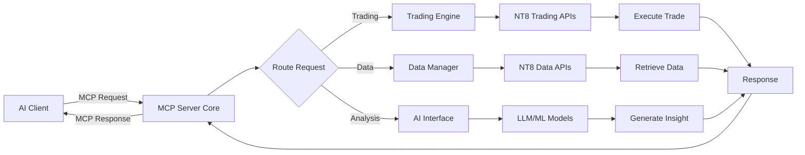

# PLANNING.md - NT8 Native MCP Server Add-On

## 🎯 Project Vision

### Mission Statement
**"Transform NinjaTrader 8 into an AI-native trading platform through seamless MCP integration."**

### Core Objective
Develop a comprehensive Model Context Protocol (MCP) server embedded directly within NinjaTrader 8 as a native add-on, enabling AI assistants (Claude, ChatGPT, custom LLMs) to interact with trading functionality through standardized protocols.

### Target Outcomes
- **Zero Programming Trading**: Enable traders to create and deploy strategies using natural language
- **AI-Powered Analysis**: Provide real-time market insights and recommendations
- **Professional Risk Management**: Implement ML-driven position sizing and risk controls
- **Seamless Integration**: Native NT8 experience with no external dependencies

### Success Metrics
- Response time <100ms for data queries
- Strategy generation <5 seconds
- System uptime >99.9%
- Error rate <0.1% for critical operations
- 10,000+ installations within 6 months

## 🏗️ System Architecture

### High-Level Architecture

```
┌─────────────────────────────────────────────────────────────────┐
│                    NinjaTrader 8 Platform                      │
├─────────────────────────────────────────────────────────────────┤
│                                                                 │
│  ┌─────────────────────────────────────────────────────────────┐│
│  │               NT8 MCP Server Add-On                        ││
│  ├─────────────────────────────────────────────────────────────┤│
│  │                                                             ││
│  │  ┌─────────────────┐  ┌─────────────────┐  ┌──────────────┐││
│  │  │  MCP Server     │  │  Trading Engine │  │ Data Manager │││
│  │  │  Core           │  │                 │  │              │││
│  │  └─────────────────┘  └─────────────────┘  └──────────────┘││
│  │                               │                             ││
│  │  ┌─────────────────┐         │       ┌──────────────────┐  ││
│  │  │   AI Interface  │◄────────┼──────►│   UI Components  │  ││
│  │  └─────────────────┘         │       └──────────────────┘  ││
│  │                               │                             ││
│  └───────────────────────────────┼─────────────────────────────┘│
│                                  │                              │
│  ┌───────────────────────────────▼─────────────────────────────┐│
│  │                 NT8 Platform APIs                          ││
│  └─────────────────────────────────────────────────────────────┘│
└─────────────────────────────────────────────────────────────────┘
                                  │
                              MCP Protocol
                                  │
                ┌─────────────────▼─────────────────┐
                │        External AI Clients        │
                │  • Claude Desktop                 │
                │  • ChatGPT                        │
                │  • VS Code with MCP               │
                └───────────────────────────────────┘
```

### Component Breakdown

#### 1. MCP Server Core
- **Protocol Handler**: Implements MCP specification v1.0
- **Transport Layer**: HTTP/WebSocket server
- **Tool Registry**: Manages available MCP tools
- **Resource Manager**: Handles MCP resources
- **Security Layer**: Authentication and authorization

#### 2. Trading Engine
- **Strategy Generator**: Natural language to NinjaScript conversion
- **Strategy Validator**: Code validation and compilation
- **Execution Manager**: Order placement and management
- **Risk Manager**: Position sizing and risk controls
- **Performance Tracker**: Real-time P&L and metrics

#### 3. Data Manager
- **Market Data Provider**: Real-time price feeds
- **Historical Data**: Bar data and tick history
- **Trade History**: Execution and performance data
- **Data Export**: JSON/CSV formatting
- **Cache Manager**: Performance optimization

#### 4. AI Interface
- **LLM Integration**: OpenAI, Anthropic, local models
- **Prompt Manager**: Template and context management
- **ML Models**: Local ML.NET models for predictions
- **Response Parser**: AI output processing
- **Context Manager**: Conversation state

#### 5. UI Components
- **MCP Dashboard**: Main control panel
- **Chat Interface**: Natural language interaction
- **Strategy Manager**: Strategy library and deployment
- **Performance Monitor**: Real-time metrics display
- **Configuration Panel**: Settings management

### Data Flow



## 💻 Technology Stack

### Core Technologies

#### Platform & Runtime
- **NinjaTrader 8**: v8.1.3.1 or higher
- **.NET Framework**: 4.8 (NT8 requirement)
- **C#**: 7.3 (maximum supported by .NET 4.8)
- **WPF**: Windows Presentation Foundation for UI

#### MCP Implementation
- **MCP Protocol**: v1.0 specification
- **Transport**: HTTP/WebSocket server
- **JSON-RPC**: 2.0 for protocol messages
- **JSON Schema**: For tool/resource definitions

#### AI Integration
- **OpenAI API**: GPT-4 for strategy generation
- **Anthropic API**: Claude for analysis
- **ML.NET**: v2.0 for local ML models
- **ONNX Runtime**: For model inference

#### Data Processing
- **Newtonsoft.Json**: JSON serialization
- **CsvHelper**: CSV export functionality
- **System.Data**: DataTable operations
- **LINQ**: Data querying and transformation

#### Security
- **JWT**: Token-based authentication
- **BCrypt.Net**: Password hashing
- **System.Security.Cryptography**: Data encryption
- **SSL/TLS**: Secure communications

#### Testing
- **MSTest**: Unit testing framework
- **Moq**: Mocking framework
- **FluentAssertions**: Assertion library
- **BenchmarkDotNet**: Performance testing

### NuGet Packages

```xml
<PackageReference Include="Newtonsoft.Json" Version="13.0.3" />
<PackageReference Include="Microsoft.ML" Version="2.0.1" />
<PackageReference Include="Microsoft.ML.OnnxRuntime" Version="1.16.3" />
<PackageReference Include="CsvHelper" Version="30.0.1" />
<PackageReference Include="BCrypt.Net-Next" Version="4.0.3" />
<PackageReference Include="System.IdentityModel.Tokens.Jwt" Version="7.0.3" />
<PackageReference Include="WebSocketSharp" Version="1.0.3-rc11" />
<PackageReference Include="Serilog" Version="3.1.1" />
<PackageReference Include="Serilog.Sinks.File" Version="5.0.0" />
```

### Development Dependencies

```xml
<PackageReference Include="MSTest.TestFramework" Version="3.1.1" />
<PackageReference Include="MSTest.TestAdapter" Version="3.1.1" />
<PackageReference Include="Moq" Version="4.20.70" />
<PackageReference Include="FluentAssertions" Version="6.12.0" />
<PackageReference Include="BenchmarkDotNet" Version="0.13.11" />
<PackageReference Include="coverlet.collector" Version="6.0.0" />
```

## 🛠️ Required Tools

### Development Environment

#### Essential Tools
1. **Visual Studio 2022** (17.8+)
   - Workloads: .NET Desktop Development, Windows Development
   - Extensions: NinjaScript Editor Extension

2. **NinjaTrader 8** (8.1.3.1+)
   - License: Developer license or higher
   - Data feed: Simulated or live connection

3. **Git** (2.40+)
   - Git LFS for binary files
   - Git Flow for branching

4. **VS Code** (Optional)
   - Extensions: C#, MCP Development Kit
   - For MCP protocol testing

#### Build Tools
1. **MSBuild** (17.0+)
   - Part of Visual Studio installation
   - Command-line builds

2. **.NET Framework 4.8 SDK**
   - Target framework for NT8

3. **NuGet CLI** (6.0+)
   - Package management

4. **ILMerge** (3.0.41)
   - Assembly merging for distribution

#### Testing Tools
1. **Postman** or **Insomnia**
   - MCP endpoint testing
   - API development

2. **dotMemory** or **PerfView**
   - Memory profiling
   - Performance analysis

3. **NT8 Strategy Analyzer**
   - Backtest validation
   - Performance metrics

4. **Fiddler** or **Wireshark**
   - Network debugging
   - Protocol analysis

#### AI Development Tools
1. **OpenAI API Key**
   - GPT-4 access
   - $100+ credit recommended

2. **Anthropic API Key** (Optional)
   - Claude integration
   - For comparative testing

3. **ML.NET Model Builder**
   - Visual Studio extension
   - Local model training

4. **ONNX Runtime Tools**
   - Model conversion
   - Inference optimization

#### Documentation Tools
1. **DocFX** (2.59+)
   - API documentation generation
   - Static site generation

2. **Mermaid CLI**
   - Diagram generation
   - Architecture visualization

3. **Swagger/OpenAPI**
   - MCP API documentation
   - Interactive testing

### Infrastructure Requirements

#### Development Machine
- **OS**: Windows 10/11 Pro (64-bit)
- **RAM**: 16GB minimum, 32GB recommended
- **CPU**: Intel i7/AMD Ryzen 7 or better
- **Storage**: 100GB free space (SSD recommended)
- **Network**: Stable internet for market data

#### NT8 Configuration
```xml
<!-- NinjaTrader.Custom.dll.config -->
<configuration>
  <runtime>
    <gcServer enabled="true"/>
    <gcConcurrent enabled="true"/>
  </runtime>
  <appSettings>
    <add key="EnableMCPServer" value="true"/>
    <add key="MCPServerPort" value="3000"/>
    <add key="LogLevel" value="Debug"/>
  </appSettings>
</configuration>
```

### Project Structure

```
C:\TenSurf\NT8-MCP-Server\
├── src/
│   ├── TenSurf.NT8.MCP/           # Main add-on project
│   ├── TenSurf.NT8.MCP.Tests/     # Test project
│   └── TenSurf.NT8.MCP.Benchmark/ # Performance tests
├── tools/
│   ├── build/                      # Build scripts
│   ├── deploy/                     # Deployment scripts
│   └── test/                       # Test utilities
├── docs/
│   ├── api/                        # API documentation
│   ├── guides/                     # User guides
│   └── architecture/               # Design documents
├── models/
│   ├── position-sizing.onnx       # ML models
│   └── risk-assessment.onnx
├── config/
│   ├── mcp-server.json            # Server configuration
│   └── ai-providers.json          # AI settings
└── scripts/
    ├── install.ps1                 # Installation script
    └── update.ps1                  # Update script
```

## 📋 Development Phases

### Phase 1: Foundation (Weeks 1-4)
- [ ] Project setup and NT8 add-on scaffold
- [ ] MCP protocol handler implementation
- [ ] Basic transport layer (HTTP/WebSocket)
- [ ] Tool registration system
- [ ] Logging and error handling

### Phase 2: Core Features (Weeks 5-8)
- [ ] Market data access tools
- [ ] Historical data export
- [ ] Strategy generation tool
- [ ] Basic risk management
- [ ] Unit test coverage

### Phase 3: AI Integration (Weeks 9-12)
- [ ] OpenAI integration
- [ ] ML.NET model integration
- [ ] Prompt engineering system
- [ ] Natural language processing
- [ ] Response optimization

### Phase 4: UI & Polish (Weeks 13-16)
- [ ] NT8 dashboard window
- [ ] Chat interface
- [ ] Configuration UI
- [ ] Performance optimization
- [ ] Security hardening
- [ ] Documentation
- [ ] Deployment package

## 🚀 Quick Start Commands

### Initial Setup
```powershell
# Clone repository
git clone https://github.com/tensurf/nt8-mcp-server.git
cd nt8-mcp-server

# Restore packages
nuget restore TenSurf.NT8.MCP.sln

# Build project
msbuild TenSurf.NT8.MCP.sln /p:Configuration=Release

# Run tests
vstest.console.exe bin\Release\TenSurf.NT8.MCP.Tests.dll

# Deploy to NT8
.\scripts\install.ps1
```

### Development Workflow
```powershell
# Start development session
git checkout -b feature/your-feature
code .  # Open in VS Code
start devenv TenSurf.NT8.MCP.sln  # Open in Visual Studio

# Build and test cycle
msbuild /t:Build /p:Configuration=Debug
vstest.console.exe bin\Debug\TenSurf.NT8.MCP.Tests.dll

# Deploy to NT8 for testing
copy bin\Debug\TenSurf.NT8.MCP.dll "%USERPROFILE%\Documents\NinjaTrader 8\bin\Custom\AddOns\"

# Start NinjaTrader 8
"C:\Program Files\NinjaTrader 8\bin\NinjaTrader.exe"
```

## 📝 Configuration Files

### MCP Server Configuration (mcp-server.json)
```json
{
  "server": {
    "port": 3000,
    "host": "localhost",
    "protocol": "http",
    "enableWebSocket": true,
    "enableCors": true,
    "allowedOrigins": ["*"]
  },
  "security": {
    "enableAuthentication": true,
    "tokenExpiration": "24h",
    "allowedClients": ["claude", "chatgpt", "vscode"]
  },
  "features": {
    "enableTrading": false,
    "enableBacktest": true,
    "enableRealTimeData": true,
    "maxConcurrentRequests": 10
  },
  "logging": {
    "level": "Information",
    "outputPath": "logs/mcp-server.log",
    "rollingInterval": "Day"
  }
}
```

### AI Providers Configuration (ai-providers.json)
```json
{
  "providers": {
    "openai": {
      "enabled": true,
      "apiKey": "${OPENAI_API_KEY}",
      "model": "gpt-4",
      "temperature": 0.1,
      "maxTokens": 2000
    },
    "anthropic": {
      "enabled": false,
      "apiKey": "${ANTHROPIC_API_KEY}",
      "model": "claude-3-opus",
      "maxTokens": 4000
    },
    "local": {
      "enabled": true,
      "modelsPath": "models/",
      "inference": "onnx"
    }
  }
}
```

## 🔍 Key Design Decisions

### 1. Native Add-On vs External Server
**Decision**: Implement as native NT8 add-on
**Rationale**: 
- Direct access to all NT8 APIs
- No external process management
- Better performance and reliability
- Simplified deployment

### 2. MCP Protocol Implementation
**Decision**: Full MCP v1.0 compliance
**Rationale**:
- Standard protocol for AI assistants
- Compatible with Claude, ChatGPT
- Extensible for future features
- Well-documented specification

### 3. Security Model
**Decision**: Token-based authentication with whitelisting
**Rationale**:
- Secure by default
- Flexible client management
- Industry standard approach
- Audit trail capability

### 4. AI Integration Strategy
**Decision**: Multi-provider support with local fallback
**Rationale**:
- Flexibility in AI provider choice
- Cost optimization
- Offline capability
- Performance optimization

## 📊 Risk Mitigation

### Technical Risks
1. **NT8 API Changes**
   - Mitigation: Version checking, compatibility layer
   
2. **Performance Issues**
   - Mitigation: Caching, async operations, profiling

3. **Security Vulnerabilities**
   - Mitigation: Security audit, penetration testing

### Business Risks
1. **Market Adoption**
   - Mitigation: Free tier, extensive documentation

2. **Competition**
   - Mitigation: First-mover advantage, rapid iteration

3. **Support Burden**
   - Mitigation: Comprehensive docs, community forum

## 🎯 Milestones & Deliverables

### Milestone 1: Alpha Release (Week 4)
- Basic MCP server running
- Market data access
- Simple tool implementation

### Milestone 2: Beta Release (Week 8)
- All core tools implemented
- AI integration working
- Basic UI complete

### Milestone 3: RC Release (Week 12)
- Feature complete
- Performance optimized
- Security hardened

### Milestone 4: Production Release (Week 16)
- Full documentation
- Installer package
- Marketing materials
- Support infrastructure

---

**Last Updated**: Project Initialization
**Next Review**: End of Phase 1
**Contact**: development@tensurf.ai